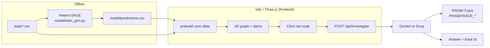

# CounterfeitTrace

CounterfeitTrace is a demo that treats a medicines, seeds, fertilizer and electronics distribution network as a directed transaction graph, scores every node for counterfeit-injection risk with a heterogeneous GraphSAGE classifier, and lets a judge click a flagged distributor in a Three.js scene and ask a serverless investigator why — with the exchange written to PRISM. The GNN runs offline in Python; the site ships static CSVs (including `model/predictions.csv`) so the graph works on Vercel without Supabase or torch in the browser.



## Local run

```bash
# optional: regenerate data + scores (Python 3, torch only here)
python -m venv .venv
# Windows: .venv\Scripts\activate
source .venv/bin/activate
pip install -r requirements.txt
python data/generate_transactions.py
python model/train_gnn.py

# site (no torch)
cd frontend
cp .env.example .env.local   # fill keys; never commit this file
npm install
npm run dev                  # http://localhost:5173 — predev syncs CSVs
```

`npm run build` / `npm run preview` use the same `prebuild` hook. It copies `data/nodes.csv`, `data/edges.csv`, and `model/predictions.csv` into `frontend/public/data/` (git-ignored). Risk colouring does not need Supabase.

## Vercel

Import [uffabdullah/forge-ai](https://github.com/uffabdullah/forge-ai). Set **Root Directory** to `frontend`. Build command is `npm run build` (`vercel.json`). Add the env vars below in the project settings — do not put secrets in the repo.

## Environment

| Variable | Where | Required | Purpose |
| --- | --- | --- | --- |
| `GEMINI_API_KEY` | server (`/api/investigate`) | one of Gemini or Groq | Google Generative Language |
| `GROQ_API_KEY` | server | one of Gemini or Groq | Groq Chat Completions (used if Gemini unset) |
| `PRISMTRACE_HOST` | server | for traces | `https://prism.blockconvey.com` |
| `PRISMTRACE_PROJECT_ID` | server | for traces | PRISM project UUID |
| `PRISMTRACE_API_KEY` | server | for traces | `pt-sk-…` header `X-PRISMtrace-Key` |
| `VITE_SUPABASE_URL` | client | no | Optional live graph later |
| `VITE_SUPABASE_ANON_KEY` | client | no | Optional; never a service-role key |

Template: `frontend/.env.example`. Vite only exposes `VITE_*` to the browser. Torch stays in `requirements.txt` for the trainer, not in `frontend/package.json`.

## 90-second demo

1. Open the site. Scroll: hero network → five sell-side signatures → Hetero-SAGE steps → workspace alerts.
2. Click a **red / flagged** distributor (or pick one from Alerts). The camera flies in; the inspector shows score and signals.
3. Jump to **Investigate**. Leave the default question (or type your own) and click **Ask agent**.
4. Read the answer. The right column shows provider, latency, and the **PRISM trace id** — open the dashboard link and confirm the same session.

## Layout

| Path | Role |
| --- | --- |
| `data/` | Synthetic generator + `nodes.csv` / `edges.csv` / `anomaly_labels.csv` |
| `model/` | Hetero-SAGE trainer + `predictions.csv` (`*.pt` git-ignored) |
| `backend/` | Optional Supabase push (not required for the demo) |
| `frontend/` | Vite app, `api/investigate`, `vercel.json` |
